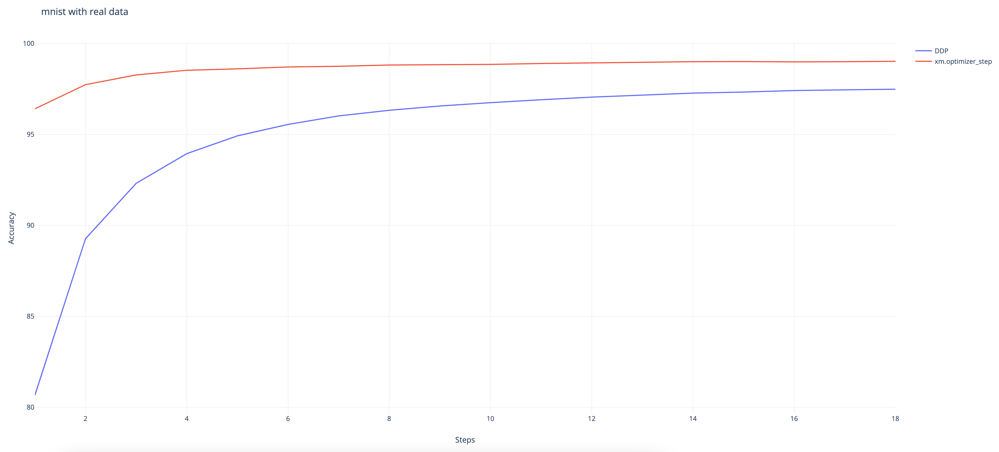

# كيفية تنفيذ DistributedDataParallel (DDP)

توضح هذه الوثيقة كيفية استخدام torch.nn.parallel.DistributedDataParallel في xla، كما تصف الاختلاف بينها وبين نهج xla الأصلي للتوازي في البيانات. يمكنك العثور على مثال قابل للتنفيذ الأدنى [هنا](https://github.com/pytorch/xla/blob/master/examples/data_parallel/train_resnet_ddp.py).

## الخلفية / الدافع

لطالما طلب العملاء القدرة على استخدام واجهة برمجة تطبيقات DistributedDataParallel من PyTorch مع xla. وهنا نقوم بتمكينها كميزة تجريبية.

## كيفية استخدام DistributedDataParallel

بالنسبة لأولئك الذين انتقلوا من وضع PyTorch Eager إلى XLA، فيما يلي جميع التغييرات التي تحتاج إلى إجرائها لتحويل نموذج DDP Eager إلى نموذج XLA. نفترض أنك تعرف بالفعل كيفية استخدام XLA [على جهاز واحد](../API_GUIDE.md#running-on-a-single-xla-device).

1. استيراد الحزم الموزعة المحددة لـ xla:

```py
import torch_xla
import torch_xla.runtime as xr
import torch_xla.distributed.xla_backend
```

2. قم بتهيئة مجموعة العمليات xla على غرار مجموعات العمليات الأخرى مثل nccl و gloo.

```py
dist.init_process_group("xla", rank=rank, world_size=world_size)
```

3. استخدم واجهات برمجة التطبيقات المحددة لـ xla للحصول على الرتبة وحجم العالم إذا كنت بحاجة إلى ذلك.

```py
new_rank = xr.global_ordinal()
world_size = xr.world_size()
```

4. قم بتمرير `gradient_as_bucket_view=True` إلى غلاف DDP.

```py
ddp_model = DDP(model, gradient_as_bucket_view=True)
```

5. أخيرًا، قم بتشغيل نموذجك باستخدام برنامج الإطلاق المحدد لـ xla.

```py
torch_xla.launch(demo_fn)
```

هنا قمنا بوضع كل شيء معًا (المثال مأخوذ بالفعل من [دليل DDP](https://pytorch.org/tutorials/intermediate/ddp_tutorial.html)). الطريقة التي تقوم بها بالترميز تشبه إلى حد كبير تجربة Eager. فقط مع لمسات xla المحددة على جهاز واحد بالإضافة إلى التغييرات الخمسة أعلاه إلى نصك البرمجي.

```py
import os
import sys
import tempfile
import torch
import torch.distributed as dist
import torch.nn as nn
import torch.optim as optim

from torch.nn.parallel import DistributedDataParallel as DDP

# additional imports for xla
import torch_xla
import torch_xla.core.xla_model as xm
import torch_xla.runtime as xr
import torch_xla.distributed.xla_backend

def setup(rank, world_size):
    os.environ['MASTER_ADDR'] = 'localhost'
    os.environ['MASTER_PORT'] = '12355'

    # initialize the xla process group
    dist.init_process_group("xla", rank=rank, world_size=world_size)

def cleanup():
    dist.destroy_process_group()

class ToyModel(nn.Module):
    def __init__(self):
        super(ToyModel, self).__init__()
        self.net1 = nn.Linear(10, 1000000)
        self.relu = nn.ReLU()
        self.net2 = nn.Linear(1000000, 5)

    def forward(self, x):
        return self.net2(self.relu(self.net1(x)))

def demo_basic(rank):
    # xla specific APIs to get rank, world_size.
    new_rank = xr.global_ordinal()
    assert new_rank == rank
    world_size = xr.world_size()

    print(f"Running basic DDP example on rank {rank}.")
    setup(rank, world_size)

    # create model and move it to XLA device
    device = xm.xla_device()
    model = ToyModel().to(device)
    # currently, graident_as_bucket_view is needed to make DDP work for xla
    ddp_model = DDP(model, gradient_as_bucket_view=True)

    loss_fn = nn.MSELoss()
    optimizer = optim.SGD(ddp_model.parameters(), lr=0.001)

    optimizer.zero_grad()
    outputs = ddp_model(torch.randn(20, 10).to(device))
    labels = torch.randn(20, 5).to(device)
    loss_fn(outputs, labels).backward()
    optimizer.step()
    # xla specific API to execute the graph
    xm.mark_step()

    cleanup()


def run_demo(demo_fn):
    # xla specific launcher
    torch_xla.launch(demo_fn)

if __name__ == "__main__":
    run_demo(demo_basic)
```

## المعايرة

### Resnet50 ببيانات وهمية

تم جمع النتائج التالية باستخدام الأمر: `python test/test_train_mp_imagenet.py --fake_data --model=resnet50 --num_epochs=1` في بيئة TPU VM V3-8 مع PyTorch و PyTorch/XLA ToT. وتم إنتاج المقاييس الإحصائية باستخدام النص البرمجي الموجود في هذا [طلب السحب](https://github.com/pytorch/xla/pull/4107). الوحدة لمعدل هي الصور في الثانية.

<table>
<tr>
<td>النوع
</td>
<td>يعني
</td>
<td>وسيط
</td>
<td>90%
</td>
<td>انحراف معياري
</td>
<td>السيرة الذاتية
</td>
</tr>
<tr>
<td>xm.optimizer_step
</td>
<td>418.54
</td>
<td>419.22
</td>
<td>430.40
</td>
<td>9.76
</td>
<td>0.02
</td>
</tr>
<tr>
<td>DDP
</td>
<td>395.97
</td>
<td>395.54
</td>
<td>407.13
</td>
<td>7.60
</td>
<td>0.02
</td>
</tr>
</table>

يبلغ الفرق في الأداء بين نهجنا الأصلي للتوازي في البيانات الموزعة وغلاف DistributedDataParallel هو: 1 - 395.97 / 418.54 = 5.39%. يبدو أن هذه النتيجة معقولة نظرًا لأن غلاف DDP يتسبب في حدوث تكاليف إضافية عند تتبع وقت تشغيل DDP.

### MNIST ببيانات وهمية

تم جمع النتائج التالية باستخدام الأمر: `python test/test_train_mp_mnist.py --fake_data` في بيئة TPU VM V3-8 مع PyTorch و PyTorch/XLA ToT. وتم إنتاج المقاييس الإحصائية باستخدام النص البرمجي الموجود في هذا [طلب السحب](https://github.com/pytorch/xla/pull/4107). الوحدة لمعدل هي الصور في الثانية.

<table>
<tr>
<td>النوع
</td>
<td>يعني
</td>
<td>وسيط
</td>
<td>90%
</td>
<td>انحراف معياري
</td>
<td>السيرة الذاتية
</td>
</tr>
<tr>
<td>xm.optimizer_step
</td>
<td>17864.19
</td>
<td>20108.96
</td>
<td>24351.74
</td>
<td>5866.83
</td>
<td>0.33
</td>
</tr>
<tr>
<td>DDP
</td>
<td>10701.39
</td>
<td>11770.00
</td>
<td>14313.78
</td>
<td>3102.92
</td>
<td>0.29
</td>
</tr>
</table>

يبلغ الفرق في الأداء بين نهجنا الأصلي للتوازي في البيانات الموزعة وغلاف DistributedDataParallel هو: 1 - 14313.78 / 24351.74 = 41.22%. نقارن هنا 90% بدلاً من ذلك نظرًا لأن مجموعة البيانات صغيرة وتتأثر الجولات القليلة الأولى بشدة بتحميل البيانات. هذا التباطؤ كبير ولكنه منطقي نظرًا لصغر حجم النموذج. من الصعب استهلاك التكلفة الإضافية لتتبع وقت تشغيل DDP.

### MNIST ببيانات حقيقية

تم جمع النتائج التالية باستخدام الأمر: `python test/test_train_mp_mnist.py --logdir mnist/` في بيئة TPU VM V3-8 مع PyTorch و PyTorch/XLA ToT.



ويمكننا أن نلاحظ أن غلاف DDP يتقارب بشكل أبطأ من النهج الأصلي لـ XLA على الرغم من أنه لا يزال يحقق معدل دقة مرتفع يبلغ 97.48% في النهاية. (يحقق النهج الأصلي 99%.)

## إخلاء المسؤولية

لا تزال هذه الميزة تجريبية وهي قيد التطوير النشط. استخدمها بحذر، ولا تتردد في الإبلاغ عن أي أخطاء إلى [مستودع github xla](https://github.com/pytorch/xla/). بالنسبة لأولئك الذين يهتمون بالنهج الأصلي للتوازي في البيانات لـ xla، إليك [الدليل](../API_GUIDE.md#running-on-multiple-xla-devices-with-multi-processing).

فيما يلي بعض المشكلات المعروفة التي يجري التحقيق فيها:

- يجب تطبيق `gradient_as_bucket_view=True`.
- هناك بعض المشكلات أثناء الاستخدام مع `torch.utils.data.DataLoader`. `test_train_mp_mnist.py` مع البيانات الحقيقية تتحطم قبل الخروج.