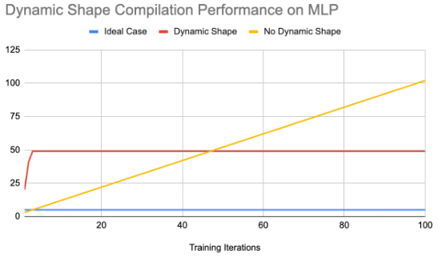

# الشكل الديناميكي

يشير الشكل الديناميكي إلى الطبيعة المتغيرة لشكل المنسوج حيث يعتمد شكله على قيمة منسوج آخر أعلى منه في التسلسل. على سبيل المثال:

```
>>> import torch, torch_xla
>>> in_tensor = torch.randint(low=0, high=2, size=(5,5), device='xla:0')
>>> out_tensor = torch.nonzero(in_tensor)
```

يعتمد شكل "out_tensor" على قيمة "in_tensor" ويحدده شكل "in_tensor". وبعبارة أخرى، عند القيام بما يلي:

```
>>> print(out_tensor.shape)
torch.Size([<=25, 2])
```

يمكنك أن ترى أن البعد الأول يعتمد على قيمة "in_tensor" وأن قيمته القصوى هي 25. نطلق على البعد الأول البعد الديناميكي. أما البعد الثاني فلا يعتمد على أي منسوجات أعلى في التسلسل، لذلك نطلق عليه البعد الثابت.

يمكن تصنيف الشكل الديناميكي بشكل أكبر إلى شكل ديناميكي محدود وشكل ديناميكي غير محدود.

- الشكل الديناميكي المحدود: يشير إلى شكل تكون أبعاده الديناميكية محدودة بقيم ثابتة. وهو يعمل مع المعالجات التي تتطلب تخصيص ذاكرة ثابت (مثل TPU).

- الشكل الديناميكي غير المحدود: يشير إلى شكل يمكن أن تكون أبعاده الديناميكية كبيرة بشكل لا نهائي. وهو يعمل مع المعالجات التي لا تتطلب تخصيص ذاكرة ثابتة (مثل GPU).

اليوم، لا يتم دعم سوى الشكل الديناميكي المحدود، وهو لا يزال في المرحلة التجريبية.

## الشكل الديناميكي المحدود

حاليًا، ندعم نماذج الشبكة العصبية الاصطناعية متعددة الطبقات (MLP) مع إدخال حجم ديناميكي على TPU.

يتم التحكم في هذه الميزة بواسطة علم "XLA_EXPERIMENTAL="nonzero:masked_select"". لتشغيل نموذج مع تمكين هذه الميزة، يمكنك القيام بما يلي:

```
XLA_EXPERIMENTAL="nonzero:masked_select:masked_scatter" python your_scripts.py
```

فيما يلي بعض الأرقام التي حصلنا عليها عند تشغيل نموذج MLP لـ 100 تكرار:

|             | بدون شكل ديناميكي | مع شكل ديناميكي     |
| :---        |    :----:         |          ---: |
| وقت التدريب من البداية إلى النهاية | 29.49             | 20.03   |
| عدد التجميعات   | 102               | 49      |
| إصابة ذاكرة التخزين المؤقت للتجميع    | 198               | 1953      |



يتمثل أحد دوافع الشكل الديناميكي في تقليل عدد عمليات إعادة التجميع المفرطة عندما يتغير الشكل باستمرار بين التكرارات. ومن الشكل أعلاه، يمكنك أن ترى أن عدد التجميعات قد انخفض إلى النصف، مما أدى إلى انخفاض وقت التدريب.

لتجربته، قم بتشغيل ما يلي:

```
XLA_EXPERIMENTAL="nonzero:masked_select" PJRT_DEVICE=TPU python3 pytorch/xla/test/ds/test_dynamic_shape_models.py TestDynamicShapeModels.test_backward_pass_with_dynamic_input
```

للحصول على مزيد من التفاصيل حول كيفية تخطيطنا لتوسيع دعم الشكل الديناميكي في PyTorch/XLA في المستقبل، يمكنك مراجعة طلب التعليقات الخاص بنا على الرابط التالي: [RFC](https://github.com/pytorch/xla/issues/3884).