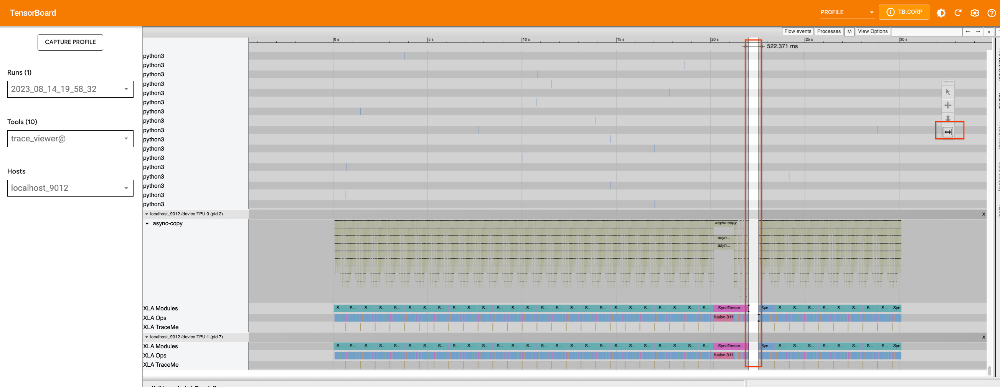

## الهدف:
يقدم هذا المستند نظرة عامة عالية المستوى على PyTorch XLA ويُظهر بعض الأمثلة على كيفية تحويل كود PyTorch لتشغيله على أجهزة XLA (مثل وحدات معالجة Tensor). هذه ليست حلاً كاملاً، وقد تكون هناك حاجة إلى تغييرات إضافية اعتمادًا على الكود المحدد. ومع ذلك، يجب أن يُستخدم هذا المستند كنقطة بداية لعملية التحويل.

# الفهم الأساسي لبعض تفاصيل XLA
يوفر هذا القسم نظرة عامة موجزة على التفاصيل الأساسية لـ PyTorch XLA، والتي يجب أن تساعد القراء على فهم التعديلات والتحسينات المطلوبة للكود بشكل أفضل.

على عكس PyTorch العادي، الذي ينفذ الكود سطرًا تلو الآخر ولا يمنع التنفيذ حتى يتم جلب قيمة موتر PyTorch، يعمل PyTorch XLA بشكل مختلف. فهو يمر عبر كود Python ويسجل العمليات على موترات XLA (PyTorch) في رسم بياني للتمثيل الوسيط (IR) حتى يواجه حاجزًا (سيتم مناقشته أدناه). تُعرف عملية إنشاء الرسم البياني IR باسم التتبع (تتبع LazyTensor أو تتبع الكود). ثم يحول PyTorch XLA رسم IR إلى تنسيق قابل للقراءة من قبل الآلة منخفض المستوى يسمى HLO (رموز Opcodes عالية المستوى). HLO هو تمثيل لحساب محدد لمترجم XLA، مما يسمح له بتوليد كود فعال للأجهزة التي يعمل عليها. يتم تغذية HLO إلى مترجم XLA للترجمة والتحسين. ثم يتم تخزين الترجمة بواسطة PyTorch XLA لإعادة استخدامها لاحقًا إذا/عندما تكون هناك حاجة إليها. تتم الترجمة على المضيف (وحدة المعالجة المركزية)، والتي هي الآلة التي تعمل كود Python. إذا كان هناك عدة أجهزة XLA، يقوم المضيف بترجمة الكود لكل من الأجهزة بشكل منفصل باستثناء عند استخدام SPMD (برنامج واحد، بيانات متعددة). على سبيل المثال، يحتوي v4-8 على آلة مضيفة واحدة و[أربع أجهزة](https://cloud.google.com/tpu/docs/system-architecture-tpu-vm#tpu_v4). في هذه الحالة، يقوم المضيف بترجمة الكود لكل من الأجهزة الأربعة بشكل منفصل. في حالة شرائح pod، عندما يكون هناك مضيفون متعددون، يقوم كل مضيف بالترجمة لأجهزة XLA التي يتصل بها. إذا تم استخدام SPMD، يتم ترجمة الكود مرة واحدة فقط (لأشكال وحسابات معينة) على كل مضيف لجميع الأجهزة.


للحصول على مزيد من التفاصيل والأمثلة، يُرجى الرجوع إلى [دليل LazyTensor](https://pytorch.org/blog/understanding-lazytensor-system-performance-with-pytorch-xla-on-cloud-tpu/).

يتم تنفيذ العمليات في رسم IR فقط عندما تكون قيم الموترات مطلوبة. يُشار إلى ذلك باسم تقييم أو ماديّة الموترات. يُطلق على ذلك أحيانًا التقييم الكسول، ويمكن أن يؤدي إلى تحسينات كبيرة في [الأداء](https://arxiv.org/pdf/2102.13267.pdf).

تعمل العمليات المتزامنة في Pytorch XLA، مثل الطباعة أو التسجيل أو نقاط التفتيش أو الاستدعاءات، على حظر التتبع وتؤدي إلى إبطاء التنفيذ. في حالة احتياج عملية إلى قيمة محددة لموتر XLA، مثل `print(xla_tensor_z)`، يتم حظر التتبع حتى تتوفر قيمة الموتر للمضيف. لاحظ أنه يتم تنفيذ جزء الرسم البياني المسؤول عن حساب قيمة الموتر فقط. لا تقطع هذه العمليات رسم IR، ولكنها تؤدي إلى اتصال المضيف بالجهاز من خلال `TransferFromDevice`، مما يؤدي إلى إبطاء الأداء.

الحاجز هو تعليمات خاصة تخبر XLA بتنفيذ رسم IR وإضفاء الطابع المادي على الموترات. وهذا يعني أن موترات PyTorch XLA سيتم تقييمها، وستكون النتائج متاحة للمضيف. الحاجز المعرض للمستخدم في Pytorch XLA هو [xm.mark_step()](https://github.com/pytorch/xla/blob/bdceee54eca1269ee954f6cdd1868c584d0e88a4/torch_xla/core/xla_model.py#L808)، والذي يكسر رسم IR ويؤدي إلى تنفيذ الكود على أجهزة XLA. إحدى الخصائص الرئيسية لـ `xm.mark_step` هي أنه، على عكس العمليات المتزامنة، لا يحظر التتبع الإضافي أثناء تنفيذ الجهاز للرسم البياني. ومع ذلك، فهو يحظر الوصول إلى قيم الموترات التي يتم إضفاء الطابع المادي عليها.

يوضح المثال في دليل LazyTensor ما يحدث في حالة بسيطة تتمثل في إضافة موترين. الآن، لنفترض أن لدينا حلقة for تضيف موترات XLA وتستخدم القيمة لاحقًا:

```py
for x, y in tensors_on_device:
  z += x + y
```

بدون حاجز، سيؤدي التتبع في Python إلى رسم بياني واحد يلف إضافة الموترات `len(tensors_on_device)` مرات. ويرجع ذلك إلى أن حلقة for لا يتم التقاطها بواسطة التتبع، لذا فإن كل تكرار للحلقة سينشئ رسمًا بيانيًا فرعيًا جديدًا يقابل حساب `z += x+y` ويضيفه إلى الرسم البياني. إليك مثال عندما `len(tensors_on_device)=3`.


ومع ذلك، فإن إضافة حاجز في نهاية الحلقة سينتج عنه رسم بياني أصغر يتم ترجمته مرة واحدة أثناء المرور الأول داخل حلقة for وسيتم إعادة استخدامه للمرات التالية `len(tensors_on_device)-1` مرات. سيؤدي الحاجز إلى إرسال إشارة إلى التتبع مفادها أنه يمكن تقديم الرسم البياني الذي تم تتبعه حتى الآن للتنفيذ، وإذا تم رؤية هذا الرسم البياني من قبل، فسيتم إعادة استخدام برنامج مجمع تم تخزينه مؤقتًا.

```py
for x, y in tensors_on_device:
  z += x + y
  xm.mark_step()
```

في هذه الحالة، سيكون هناك رسم بياني صغير يستخدم `len(tensors_on_device)=3` مرات.


من المهم تسليط الضوء على أنه في PyTorch XLA يتم تتبع كود Python داخل حلقات for ويتم إنشاء رسم بياني جديد لكل تكرار إذا كان هناك حاجز في النهاية. يمكن أن يكون هذا عنق زجاجة كبير للأداء.

يمكن إعادة استخدام رسوم XLA عندما يحدث نفس الحساب على نفس أشكال الموترات. إذا تغيرت أشكال المدخلات أو الموترات الوسيطة، فسيقوم مترجم XLA بإعادة ترجمة رسم بياني جديد بأشكال موترات جديدة. وهذا يعني أنه إذا كان لديك أشكال ديناميكية أو إذا لم يعيد كودك استخدام رسوم الموترات، فإن تشغيل نموذجك على XLA لن يكون مناسبًا لتلك الحالة. يمكن أن يكون حشو الإدخال إلى شكل ثابت خيارًا للمساعدة في تجنب الأشكال الديناميكية. وإلا، سيقضي المترجم قدرًا كبيرًا من الوقت في تحسين ودمج العمليات التي لن يتم استخدامها مرة أخرى.

من المهم أيضًا مراعاة المقايضة بين حجم الرسم البياني ووقت الترجمة. إذا كان هناك رسم بياني IR كبير واحد، فقد يقضي مترجم XLA الكثير من الوقت في تحسين ودمج العمليات. قد يؤدي ذلك إلى وقت ترجمة طويل للغاية. ومع ذلك، قد يكون التنفيذ اللاحق أسرع بكثير، وذلك بفضل التحسينات التي تم إجراؤها أثناء الترجمة.

في بعض الأحيان، يكون من المفيد كسر رسم IR باستخدام `xm.mark_step()`. كما هو موضح أعلاه، سيؤدي هذا إلى رسم بياني أصغر يمكن إعادة استخدامه لاحقًا. ومع ذلك، فإن جعل الرسوم البيانية أصغر يمكن أن يقلل من التحسينات التي يمكن أن يقوم بها مترجم XLA.

نقطة أخرى مهمة يجب مراعاتها هي [MPDeviceLoader](https://github.com/pytorch/xla/blob/a1f822e2627a5639464273241821852677401026/torch_xla/distributed/parallel_loader.py#L186). بمجرد تشغيل الكود على جهاز XLA، فكر في لف برنامج تحميل البيانات في PyTorch باستخدام XLA `MPDeviceLoader` الذي يحمل مسبقًا البيانات إلى الجهاز لتحسين الأداء ويتضمن `xm.mark_step()` فيه. يؤدي الأخير تلقائيًا إلى كسر التكرارات عبر دفعات البيانات وإرسالها للتنفيذ. لاحظ أنه إذا كنت لا تستخدم MPDeviceLoader، فقد تحتاج إلى تعيين `barrier=True` في `optimizer_step()` لتمكين `xm.mark_step()` إذا كنت تقوم بتشغيل مهمة تدريب أو إضافة `xm.mark_step()` بشكل صريح.

# إعداد TPU
قم بإنشاء TPU باستخدام صورة أساسية لاستخدام العجلات الليلية أو من الإصدار الثابت عن طريق تحديد `RUNTIME_VERSION`.

```
export ZONE=us-central2-b
export PROJECT_ID=your-project-id
export ACCELERATOR_TYPE=v4-8 # v4-16, v4-32, …
export RUNTIME_VERSION=tpu-vm-v4-pt-2.0 # or tpu-vm-v4-base
export TPU_NAME=your_tpu_name

gcloud compute tpus tpu-vm create ${TPU_NAME} \
--zone=${ZONE} \
--accelerator-type=${ACCELERATOR_TYPE} \
--version=${RUNTIME_VERSION} \
--subnetwork=tpusubnet
```

إذا كان لديك آلة افتراضية مضيفة واحدة (مثل v4-8)، فيمكنك الاتصال بالآلة الافتراضية الخاصة بك عبر SSH وتشغيل الأوامر التالية من الآلة الافتراضية مباشرة. في حالة وحدات TPU ذات البود، يمكنك استخدام `--worker=all --command=""` مشابه لما يلي

```
gcloud compute tpus tpu-vm ssh ${TPU_NAME} \
--zone=us-central2-b \
--worker=all \
--command="pip3 install https://storage.googleapis.com/pytorch-xla-releases/wheels/tpuvm/torch-nightly-cp38-cp38-linux_x86_64.whl"
```

بعد ذلك، إذا كنت تستخدم الصورة الأساسية، فقم بتثبيت الحزم الليلية والمكتبات المطلوبة

```
pip3 install https://storage.googleapis.com/pytorch-xla-releases/wheels/tpuvm/torch-nightly-cp38-cp38-linux_x86_64.whl
pip3 install https://storage.googleapis.com/pytorch-xla-releases/wheels/tpuvm/torch_xla-nightly-cp38-cp38-linux_x86_64.whl
sudo apt-get install libopenblas-dev -y

sudo apt-get update && sudo apt-get install libgl1 -y # خاص بالانتشار
```

# تحويل الكود إلى PyTorch XLA
المبادئ التوجيهية العامة لتعديل كودك:
* استبدل `cuda` بـ `xm.xla_device()`
* إزالة شريط التقدم، والطباعة التي من شأنها الوصول إلى قيم موتر XLA
* تقليل التسجيل والاستدعاءات التي من شأنها الوصول إلى قيم موتر XLA
* لف برنامج تحميل البيانات باستخدام MPDeviceLoader
* إنشاء ملف تعريف لتحسين الكود بشكل أكبر

تذكر: كل حالة فريدة، لذلك قد تحتاج إلى القيام بشيء مختلف لكل حالة.

# المثال 1. استنتاج الانتشار المستقر في PyTorch Lightning على جهاز TPU واحد
كمثال أول، ضع في اعتبارك [كود الاستدلال](https://github.com/pytorch-tpu/stable-diffusion/blob/main/scripts/txt2img.py) لنموذج الانتشار المستقر في PyTorch Lightning الذي يمكن تشغيله من سطر الأوامر على النحو التالي

```
python scripts/txt2img.py --prompt "a photograph of an astronaut riding a horse"
```

للاطلاع، يمكن العثور على الفرق في التعديلات الموضحة أدناه [هنا](https://github.com/pytorch-tpu/stable-diffusion/commit/57f398eb784387e244dc5fb78421aa5261abd1ef). دعنا نمر عليها خطوة بخطوة.

كما هو موضح في المبدأ التوجيهي العام أعلاه، ابدأ بالتغييرات المتعلقة بجهاز `cuda`. تم كتابة كود الاستدلال هذا لتشغيله على وحدات معالجة الرسوميات ويمكن العثور على `cuda` في أماكن متعددة. ابدأ بإجراء التغييرات عن طريق إزالة `model.cuda()` من [هذا السطر](https://github.com/pytorch-tpu/stable-diffusion/blob/978da4c625a712a01ee066d019a0b0d2319cd8b3/scripts/txt2img.py#L64)، و`precision_scope` من [هنا](https://github.com/pytorch-tpu/stable-diffusion/blob/978da4c625a712a01ee066d019a0b0d2319cd8b3/scripts/txt2img.py#L290). بالإضافة إلى ذلك، استبدل جهاز `cuda` في [هذا السطر](https://github.com/pytorch-tpu/stable-diffusion/blob/978da4c625a712a01ee066d019a0b0d2319cd8b3/scripts/txt2img.py#L248) بجهاز `xla` مشابه للكود أدناه:

بعد ذلك، يستخدم هذا التكوين الخاص بالنموذج `FrozenCLIPEmbedder`، لذلك سنعدل هذا [السطر](https://github.com/pytorch-tpu/stable-diffusion/blob/978da4c625a712a01ee066d019a0b0d2319cd8b3/ldm/modules/encoders/modules.py#L143) أيضًا. لمزيد من البساطة، سنحدد `device` مباشرة في هذا البرنامج التعليمي، ولكن يمكنك تمرير قيمة `device` إلى الدالة أيضًا.

```
import torch_xla.core.xla_model as xm
self.device = xm.xla_device()
```

مكان آخر في الكود يحتوي على كود محدد لـ cuda هو جدول DDIM. أضف `استيراد torch_xla.core.xla_model كما xm` أعلى الملف ثم استبدل [هذه](https://github.com/pytorch-tpu/stable-diffusion/blob/978da4c625a712a01ee066d019a0b0d2319cd8b3/ldm/models/diffusion/ddim.py#L21-L22) الأسطر

```
if attr.device != torch.device("cuda"):
   attr = attr.to(torch.device("cuda"))
```

مع

```
device = xm.xla_device()
attr = attr.to(torch.device(device))
```

بعد ذلك، يمكنك تقليل الاتصال بين الجهاز (TPU) والمضيف (وحدة المعالجة المركزية) عن طريق إزالة عبارات الطباعة، وتعطيل أشرطة التقدم، وتقليل الاستدعاءات أو إزالتها والتسجيل. تتطلب هذه العمليات من الجهاز التوقف عن التنفيذ، والعودة إلى وحدة المعالجة المركزية، وتنفيذ التسجيل/الاستدعاءات، ثم العودة إلى الجهاز. يمكن أن يكون هذا عنق زجاجة كبير للأداء، خاصة في النماذج الكبيرة.

بعد إجراء هذه التغييرات، سيعمل الكود على وحدات TPU. ومع ذلك، سيكون الأداء بطيئًا جدًا. ويرجع ذلك إلى أن مترجم XLA يحاول بناء رسم بياني واحد (ضخم) يلف عدد خطوات الاستدلال (في هذه الحالة، 50) نظرًا لعدم وجود حاجز داخل حلقة for. من الصعب على المترجم تحسين الرسم البياني، مما يؤدي إلى تدهور كبير في الأداء. كما نوقش أعلاه، فإن كسر حلقة for بالحاجز (xm.mark_step()) سينتج عنه رسم بياني أصغر يمكن للمترجم تحسينه بسهولة أكبر. سيسمح هذا أيضًا للمترجم بإعادة استخدام الرسم البياني من الخطوة السابقة، مما قد يحسن
# مثال 2. الاستدلال باستخدام Stable Diffusion من Hugging Face

الآن، لنأخذ في الاعتبار استخدام [الاستدلال باستخدام Stable Diffusion](https://github.com/huggingface/diffusers/tree/main/examples/text_to_image) من مكتبة HuggingFace diffusers لكل من إصداري SD-XL و2.1 من النموذج. للرجوع، يمكن العثور على التغييرات الموضحة أدناه في هذا [المستودع](https://github.com/pytorch-tpu/diffusers). يمكنك استنساخ المستودع وتشغيل الاستدلال باستخدام الأمر التالي على جهاز TPU الظاهري:

```
(vm)$ git clone https://github.com/pytorch-tpu/diffusers.git
(vm)$ cd diffusers/examples/text_to_image/
(vm)$ python3 inference_tpu_single_device.py
```

# التشغيل على جهاز TPU واحد

يصف هذا القسم التغييرات التي يجب إجراؤها على [رمز مثال الاستدلال text_to_image](https://github.com/huggingface/diffusers/tree/main/examples/text_to_image#inference) لتشغيله على وحدات معالجة Tensor Processing Units (TPUs).

يستخدم الكود الأصلي Lora للاستدلال، ولكن هذا البرنامج التعليمي لن يستخدمه. بدلاً من ذلك، سنقوم بتعيين وسيط `model_id` إلى `stabilityai/stable-diffusion-xl-base-0.9` عند تهيئة الأنبوب. كما سنستخدم المخطط الافتراضي (DPMSolverMultistepScheduler). ومع ذلك، يمكن إجراء تغييرات مماثلة على المخططات الأخرى أيضًا.

```
git clone https://github.com/huggingface/diffusers
cd diffusers
pip install . # pip install -e .

cd examples/text_to_image/
pip install -r requirements.txt
pip install invisible_watermark transformers accelerate safetensors
```

(إذا لم يتم العثور على `accelerate`، فقم بتسجيل الخروج، ثم سجل الدخول مرة أخرى.)

سجل الدخول إلى حسابك على Hugging Face ووافق على [رخصة sd-xl 0.9](https://huggingface.co/stabilityai/stable-diffusion-xl-base-0.9) على بطاقة النموذج. بعد ذلك، انتقل إلى [علامة تبويب الرموز المميزة للوصول إلى الإعدادات](https://huggingface.co/settings/tokens) وقم بتوليد رمز مميز جديد. انسخ الرمز المميز وقم بتشغيل الأمر التالي مع قيمة الرمز المميز المحددة على جهازك الظاهري:

```
(vm)$ huggingface-cli login --token _your_copied_token__
```

توفر قراءة Hugging Face رمز PyTorch مكتوبًا للتشغيل على وحدات معالجة الرسوميات (GPU). لتشغيله على TPUs، تتمثل الخطوة الأولى في تغيير جهاز CUDA إلى جهاز XLA. يمكن القيام بذلك عن طريق استبدال السطر `pipe.to("cuda")` بالأسطر التالية:

```
import torch_xla.core.xla_model as xm
device = xm.xla_device()
pipe.to(device)
```

بالإضافة إلى ذلك، من المهم ملاحظة أن عملية الاستدلال الأولى باستخدام XLA ستستغرق وقتًا طويلاً للتجميع. على سبيل المثال، قد تستغرق عملية تجميع الاستدلال لنموذج Stable Diffusion XL من Hugging Face حوالي ساعة، في حين أن الاستدلال الفعلي قد يستغرق 5 ثوانٍ فقط، وذلك حسب حجم الدفعة. وبالمثل، قد يستغرق نموذج GPT-2 حوالي 10-15 دقيقة للتجميع، وبعد ذلك يصبح وقت حقبة التدريب أسرع بكثير. ويرجع ذلك إلى أن XLA تبني رسمًا بيانيًا للحساب الذي سيتم إجراؤه، ثم تحسن هذا الرسم البياني للأجهزة المحددة التي تعمل عليها. ومع ذلك، بمجرد تجميع الرسم البياني، يمكن إعادة استخدامه للاستدلالات اللاحقة، والتي ستكون أسرع بكثير. لذلك، إذا كنت تشغل الاستدلال مرة واحدة فقط، فقد لا تستفيد من استخدام XLA. ومع ذلك، إذا كنت تشغل الاستدلال عدة مرات، أو إذا كنت تشغل الاستدلال على قائمة من المطالبات، فستبدأ في رؤية مزايا XLA بعد الاستدلالات القليلة الأولى. على سبيل المثال، إذا قمت بتشغيل الاستدلال على قائمة من 10 مطالبات، فقد تستغرق عملية الاستدلال الأولى (وربما اثنتين [^1]) وقتًا طويلاً للتجميع، ولكن خطوات الاستدلال المتبقية ستكون أسرع بكثير. ويرجع ذلك إلى أن XLA ستعيد استخدام الرسم البياني الذي تم تجميعه للاستدلال الأول.

إذا حاولت تشغيل الكود دون إجراء أي تغييرات إضافية، فستلاحظ أن وقت التجميع طويل جدًا (>6 ساعات). ويرجع ذلك إلى أن مترجم XLA يحاول بناء رسم بياني واحد لجميع خطوات المخطط في وقت واحد، على غرار ما ناقشناه في المثال السابق. لجعل الكود يعمل بشكل أسرع، نحتاج إلى تقسيم الرسم البياني إلى قطع أصغر باستخدام `xm.mark_step()` وإعادة استخدامها في الخطوات التالية. يحدث هذا داخل دالة `pipe.__call__` [function](https://github.com/huggingface/diffusers/blob/2b1786735e27bc97f4d4699712292d5c463a7380/src/diffusers/pipelines/stable_diffusion_xl/pipeline_stable_diffusion_xl.py#L559) في [هذه الأسطر](https://github.com/huggingface/diffusers/blob/2b1786735e2ORwbc97f4d4699712292d5c463a7380/src/diffusers/pipelines/stable_diffusion_xl/pipeline_stable_diffusion_xl.py#L805-L839). يؤدي تعطيل شريط التقدم وإزالة الاستدعاءات وإضافة `xm.mark_step()` في نهاية حلقة for إلى تسريع الكود بشكل كبير. تتوفر التغييرات في هذا [الالتزام](https://github.com/huggingface/diffusers/compare/main...pytorch-tpu:diffusers:main).

بالإضافة إلى ذلك، فإن دالة `self.scheduler.step()`، التي تستخدم بشكل افتراضي المخطط DPMSolverMultistepScheduler، بها بعض المشكلات الموضحة في
[تحذيرات PyTorch XLA](https://pytorch.org/xla/release/2.0/index.html#known-performance-caveats). تؤدي استدعاءات `.nonzero()` و`.item()` في هذه الدالة إلى إرسال طلبات إلى وحدة المعالجة المركزية لتقييم المصفوفة، والتي تؤدي إلى الاتصال بين الجهاز والمضيف. هذا غير مرغوب فيه، لأنه يمكن أن يبطئ الكود. في هذه الحالة، يمكننا تجنب هذه الاستدعاءات عن طريق تمرير الفهرس إلى الدالة مباشرةً. سيمنع هذا الدالة من إرسال طلبات إلى وحدة المعالجة المركزية، وسيحسن أداء الكود. تتوفر التغييرات في [هذا](https://github.com/pytorch-tpu/diffusers/commit/0243d2ef9c2c7bc06956bb1bcc92c23038f6519d) الالتزام. الكود الآن جاهز للتشغيل على TPUs.

[^1]: 0 و1 هي أرقام سحرية في XLA ويعاملان كثوابت في HLO. لذا، إذا كان هناك مولد رقم عشوائي في الكود يمكنه توليد هذه القيم، فسيتم تجميع الكود لكل قيمة بشكل منفصل. يمكن تعطيل هذا باستخدام متغير البيئة `XLA_NO_SPECIAL_SCALARS=1`.

# التوصيف وتحليل الأداء

للمزيد من التحقيق في أداء النموذج، يمكننا توصيفه باستخدام دليل التوصيف [guide](https://cloud.google.com/tpu/docs/pytorch-xla-performance-profiling-tpu-vm). كقاعدة عامة، يجب تشغيل نص التوصيف البرمجي بحجم دفعة أقصى يناسب الذاكرة من أجل [الاستخدام الأمثل للذاكرة](https://cloud.google.com/tpu/docs/performance-guide). كما يساعد في تداخل تتبع الكود مع تنفيذ الجهاز، مما يؤدي إلى استخدام الجهاز بشكل أكثر مثالية. يجب أن تكون مدة التوصيف طويلة بما يكفي لالتقاط خطوة واحدة على الأقل. يعني الأداء الجيد للنموذج على TPUs أن الاتصال بين الجهاز والمضيف يتم تقليله إلى الحد الأدنى وأن الجهاز يعمل باستمرار دون وقت خامل.

بدء خادم في ملف `inference_tpu_*.py` وتشغيل نص برمجي `capture_profile.py` كما هو موضح في الدليل سيوفر لنا معلومات حول العمليات التي تعمل على الأجهزة. حاليًا، يتم توصيف جهاز XLA واحد فقط. لفهم وقت الخمول لجهاز TPU (الفجوات في التوصيف)، يجب إضافة آثار التوصيف (`xp.Trace()`) إلى الكود. تقيس `xp.Trace()` الوقت الذي يستغرقه تتبع الكود Python على جهاز الكمبيوتر المضيف الملفوف مع التتبع. في هذا المثال، تم إضافة آثار `xp.Trace()` داخل [الأنبوب](https://github.com/ssusie/diffusers/blob/main/src/diffusers/pipelines/stable_diffusion_xl/pipeline_stable_diffusion_xl.py) و [نموذج U-net](https://github.com/ssusie/diffusers/blob/main/src/diffusers/models/unet_2d_condition.py) لقياس الوقت اللازم لتشغيل أقسام محددة من الكود على المضيف (CPU).

إذا كانت الفجوات في التوصيف ترجع إلى تتبع كود Python الذي يحدث على المضيف، فقد يكون ذلك عنق زجاجة ولا يوجد تحسين مباشر آخر يمكن القيام به. وإلا، يجب إجراء مزيد من التحليل للكود لفهم التحذيرات وتحسين الأداء بشكل أكبر. لاحظ أنه لا يمكنك لف `xp.Trace()` أجزاء من الكود حيث يتم استدعاء `xm.mark_step()`.

لتوضيح ذلك، يمكننا النظر في ملفات التعريف التي تم التقاطها بالفعل والتي تم تحميلها إلى TensorBoard وفقًا لدليل التوصيف.

بدءًا من إصدار Stable Diffusion model 2.1

إذا قمنا بالتقاط ملف تعريف دون إدراج أي آثار، فسنرى ما يلي:


يبدو أن جهاز TPU الفردي على v4-8، والذي يحتوي على نواتين، مشغول. لا توجد فجوات كبيرة في استخدامها، باستثناء واحدة صغيرة في المنتصف. إذا قمنا بالتمرير لأعلى لمحاولة العثور على العملية التي تشغل جهاز الكمبيوتر المضيف، فلن نجد أي معلومات. لذلك، سنضيف `xp.traces` إلى ملف [الأنبوب](https://github.com/pytorch-tpu/diffusers/blob/main/src/diffusers/pipelines/stable_diffusion/pipeline_stable_diffusion.py) وكذلك دالة [U-net](https://github.com/pytorch-tpu/diffusers/blob/main/src/diffusers/models/unet_2d_condition.py). قد لا يكون الأخير مفيدًا لهذه الحالة الاستخدامية بالذات، ولكنه يوضح كيف يمكن إضافة آثار في أماكن مختلفة وكيف يتم عرض معلوماتها في TensorBoard.

إذا أضفنا آثارًا وأعدنا التقاط ملف التعريف بحجم الدفعة الأكبر الذي يمكن أن يناسب الجهاز (32 في هذه الحالة)، فسنرى أن الفجوة في الجهاز تسببها عملية Python تعمل على جهاز الكمبيوتر المضيف.




يمكننا استخدام الأداة المناسبة للتكبير في الجدول الزمني ومعرفة العملية التي تعمل خلال تلك الفترة. هذا هو عندما يحدث تتبع كود Python على المضيف، ولا يمكننا تحسين التتبع أكثر من ذلك في هذه المرحلة.

والآن، دعنا نلقي نظرة على إصدار XL من النموذج ونفعل الشيء نفسه. سنضيف آثارًا إلى ملف [الأنبوب](https://github.com/pytorch-tpu/diffusers/blob/main/src/diffusers/pipelines/stable_diffusion_xl/pipeline_stable_diffusion_xl.py) بنفس الطريقة التي فعلناها للإصدار 2.1 ونلتقط ملف تعريف.


هذه المرة، بالإضافة إلى الفجوة الكبيرة في المنتصف، والتي تسببها `pipe_watermark` tracing، هناك العديد من الفجوات الصغيرة بين خطوات الاستدلال داخل [حلقة هذا](https://github.com/pytorch-tpu/diffusers/blob/0243d2ef9c2c7bc06956bb1bcc92c23038f6519d/src/diffusers/pipelines/stable_diffusion_xl/pipeline_stable_diffusion_xl.py#L814-L830).

ألق نظرة فاحصة على الفجوة الكبيرة التي تسببها `pipe_watermark`. تسبق الفجوة عبارة `TransferFromDevice` والتي تشير إلى أن شيئًا ما يحدث على جهاز الكمبيوتر المضيف ينتظر اكتمال الحساب قبل المتابعة. بالنظر إلى كود العلامة المائية [code](https://github.com/pytorch-tpu/diffusers/blob/0243d2ef9c2c7bc06956bb1bcc92c23038f6519d/src/diffusers/pipelines/stable_diffusion_xl/watermark.py#L29)، يمكننا أن نرى أنه يتم نقل المصفوفات إلى وحدة المعالجة المركزية وتحويلها إلى مصفوفات Numpy من أجل معالجتها لاحقًا باستخدام مكتبات `cv2` و`pywt`. نظرًا لأن هذا الجزء ليس من السهل تحسينه، فسنتركه كما هو.

والآن إذا قمنا بالتكبير على الحلقة، فيمكننا أن نرى أن الرسم البياني داخل الحلقة يتم تقسيمه إلى أجزاء أصغر لأن عملية `TransferFromDevice` تحدث.


إذا قمنا بفحص دالة U-Net والمخطط، فيمكننا أن نرى أن كود U-Net لا يحتوي على أي أهداف تحسين لـ PyTorch/XLA. ومع ذلك، هناك استدعاءات `.item()` و`.nonzero()` داخل [المخطط.الخطوة](https://github.com/huggingface/diffusers/blob/15782fd506e8c4a7c2b288fc2e558bd77fdfa51a/src/diffusers/schedulers/scheduling_euler_discrete.py#L371). يمكننا [إعادة كتابة](https://github.com/pytorch-tpu/diffusers/blob/0243d2ef9c2c7bc06956bb1bcc92c23038f6519d/src/diffusers/schedulers/scheduling_euler_discrete.py#L310) الدالة لتجنب تلك الاستدعاءات. إذا قمنا بإصلاح هذه المشكلة وأعدنا تشغيل ملف التعريف، فلن نرى الكثير من الاختلاف. ومع ذلك، نظرًا لأننا قللنا من الاتصال بين الجهاز والمضيف الذي كان يقدم رسومًا بيانية أصغر، فقد سمحنا للمترجم بتحسين الكود بشكل أفضل. تحتوي دالة [scale_model_input](https://github.com/huggingface/diffusers/blob/15782fd506e8c4a7c2b288fc2e558bd77fdfa51a/src/diffusers/schedulers/scheduling_euler_discrete.py#L205) على مشكلات مماثلة، ويمكننا إصلاحها عن طريق إجراء التغييرات التي أجريناها أعلاه على دالة `step`. بشكل عام، نظرًا لأن العديد من الفجوات تسببها عملية تتبع كود المستوى Python وبناء الرسم البياني، فمن غير الممكن تحسين هذه الفجوات باستخدام الإصدار الحالي من PyTorch XLA، ولكن قد نرى تحسينات في المستقبل عندما يتم تمكين الدينامو في PyTorch XLA.
: هذا الدليل يشرح كيفية تشغيل التعليمات البرمجية على أجهزة TPU متعددة وأجهزة TPU Pod.

# التشغيل على أجهزة TPU متعددة

لاستخدام أجهزة TPU متعددة، يمكنك استخدام دالة `torch_xla.launch` لتشغيل الدالة التي قمت بتشغيلها على جهاز واحد إلى أجهزة متعددة. ستبدأ دالة `torch_xla.launch` العمليات على أجهزة TPU متعددة وتزامنها عند الحاجة. يمكن القيام بذلك عن طريق تمرير وسيط `index` إلى الدالة التي تعمل على جهاز واحد. على سبيل المثال،

```py
import torch_xla

def my_function(index):
  # function that runs on a single device

torch_xla.launch(my_function, args=(0,))
```

في هذا المثال، سيتم تشغيل دالة `my_function` على 4 أجهزة TPU على v4-8، مع تعيين فهرس لكل جهاز من 0 إلى 3. لاحظ أنه بشكل افتراضي، ستقوم دالة launch() بتشغيل العمليات على جميع أجهزة TPU. إذا كنت تريد تشغيل عملية واحدة فقط، فقم بتعيين وسيط `launch(..., debug_single_process=True)`.

يوضح [هذا الملف](https://github.com/ssusie/diffusers/blob/main/examples/text_to_image/inference_tpu_multidevice.py) كيفية استخدام xmp.spawn لتشغيل إصدار Stable Diffusion 2.1 على أجهزة TPU متعددة. بالنسبة لهذا الإصدار، تم إجراء تغييرات مماثلة على ملف [pipeline](https://github.com/huggingface/diffusers/blob/main/src/diffusers/pipelines/stable_diffusion/pipeline_stable_diffusion.py).

# التشغيل على أجهزة TPU Pod

بمجرد حصولك على التعليمات البرمجية للتشغيل على جهاز مضيف واحد، لا يلزم إجراء أي تغييرات إضافية. يمكنك إنشاء TPU Pod، على سبيل المثال، باتباع هذه [التعليمات](https://cloud.google.com/tpu/docs/pytorch-pods#create-tpu-vm). ثم قم بتشغيل البرنامج النصي الخاص بك باستخدام

```
gcloud compute tpus tpu-vm ssh ${TPU_NAME} \
  --zone=${ZONE} \
  --worker=all \
  --command="python3 your_script.py"
```